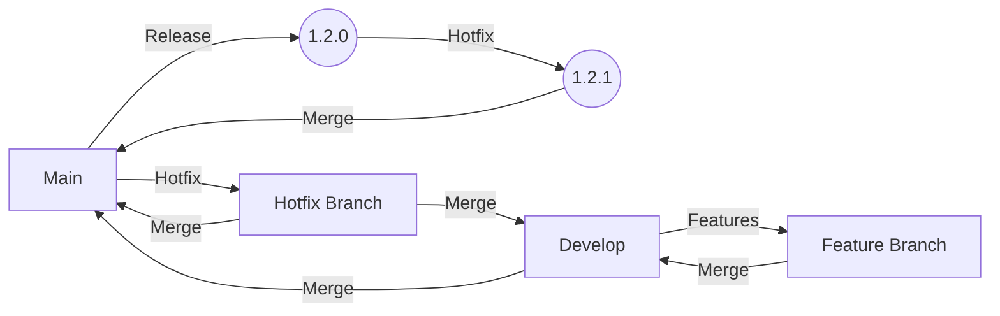

# Guide de Contribution

Merci pour votre intérêt à contribuer au projet Judoseclin! Avant de commencer, nous vous demandons de bien vouloir lire et respecter les règles de contribution détaillées ci-dessous.

## Documentation Technique

Nous avons mis en place une documentation technique complète pour aider à guider le développement. Veillez à lire et suivre attentivement cette documentation. Elle contient des informations précieuses sur la structure de code, les styles de programmation, les principes de conception, et plus encore.

[Documentation technique](technical.md)

## Principes SOLID

Nous adhérons aux principes SOLID de la programmation orientée objet. Ces principes favorisent un code plus lisible, extensible et maintenable. Ils incluent :

- **S**ingle Responsibility Principle (Principe de Responsabilité Unique)
- **O**pen/Closed Principle (Principe Ouvert/Fermé)
- **L**iskov Substitution Principle (Principe de Substitution de Liskov)
- **I**nterface Segregation Principle (Principe de Ségrégation des Interfaces)
- **D**ependency Inversion Principle (Principe d'Inversion des Dépendances)

Plus de détails sur la [Documentation technique](technical.md)

## Clean Architecture

Nous utilisons la Clean Architecture pour structurer notre projet. Cela signifie que nous séparons les différentes préoccupations de notre application en "cercles" concentriques :

- **Entities** : contient des objets métier qui sont indépendants du reste du système.
- **Use Cases** : contient la logique métier spécifique à l'application.
- **Interface Adapters** : convertit les données entre les formats les plus pratiques pour les Use Cases et les Entities vers les formats nécessaires par des éléments tels que la base de données ou l'interface utilisateur.
- **Frameworks and Drivers** : contient tout ce qui peut être considéré comme un détail technique (interface utilisateur, bases de données, serveurs web, etc).

Plus de détails sur la [Documentation technique](technical.md)

## Utilisation de Flutter_bloc

Pour la gestion de l'état de l'interface utilisateur, nous utilisons le package Flutter_bloc. Pour chaque interface utilisateur qui nécessite un état, nous utilisons soit un `Cubit` (si l'état ne nécessite pas d'événements) ou un `Bloc` (si l'état nécessite des événements).

Plus de détails sur la [Documentation technique](technical.md)

## Piloter ses développements par les tests de comportement

Nous utilisons les tests de comportement pour piloter le développement de nouvelles fonctionnalités. Cela signifie que nous écrivons d'abord un test de comportement qui décrit le comportement attendu de la fonctionnalité, puis nous écrivons le code pour faire passer le test.

Le principe est le suivant :
1. Écrire un test de comportement qui décrit le comportement attendu de la fonctionnalité.
2. Exécuter le test de comportement et vérifier qu'il échoue.
3. Écrire le code pour faire passer le test de comportement.
4. Exécuter le test de comportement et vérifier qu'il réussit.
5. Refactorer le code si nécessaire.
6. Répéter les étapes 1 à 5 jusqu'à ce que le comportement attendu soit atteint.

Plus de détails sur la [Documentation technique](technical.md)

## Git Flow

Nous utilisons la méthode Git Flow pour organiser notre travail de versionnement. Cela signifie que nous avons deux branches principales, `main` et `develop`, ainsi que des branches de fonctionnalités, de hotfix et de release. Vous trouverez ci-dessous un exemple de graphique montrant comment nous utilisons Git Flow:

## Nommage des commits

Nous utilisons les règles de nommage des commits Angular, ce qui signifie que chaque message de commit doit avoir un préfixe qui indique le type de modification qui a été apportée :

- **feat** : une nouvelle fonctionnalité
- **fix** : une correction de bug
- **docs** : des modifications de documentation
- **style** : des modifications qui n'affectent pas le sens du code (espaces blancs, mise en forme, manque de point-virgule, etc)
- **refactor** : un changement de code qui n'ajoute ni ne corrige de fonctionnalité
- **perf** : un changement de code qui améliore les performances
- **test** : en ajoutant des tests manquants
- **chore** : des modifications à la structure du code ou aux outils auxiliaires

## Faire une Pull Request

Pour contribuer au projet, vous devrez faire une Pull Request (PR). Voici les étapes pour le faire :

1. **Forker le Repository** : Cliquez sur le bouton "Fork" en haut à droite du repository pour créer une copie du projet sur votre compte GitHub.

2. **Cloner le Repository** : Clonez le repository forké sur votre machine locale.

3. **Créer une Nouvelle Branche** : Créez une nouvelle branche pour votre fonctionnalité ou votre correction.

4. **Faire vos Modifications** : Apportez vos modifications en respectant les règles ci-dessus.

5. **Commiter vos Modifications** : Committez vos modifications en suivant les règles de nommage des commits.

6. **Pusher vos Modifications** : Poussez vos modifications sur votre repository forké sur GitHub.

7. **Créer une Pull Request** : Sur la page de votre repository sur GitHub, cliquez sur le bouton "New Pull Request". Assurez-vous de bien expliquer les modifications que vous proposez.

Après avoir soumis votre PR, elle sera examinée par l'équipe de mainteneurs. Vous pourriez avoir besoin de faire quelques modifications supplémentaires en fonction de leurs commentaires avant que votre PR ne soit acceptée.

Merci encore pour votre intérêt à contribuer à notre projet! Nous sommes impatients de voir vos contributions.
