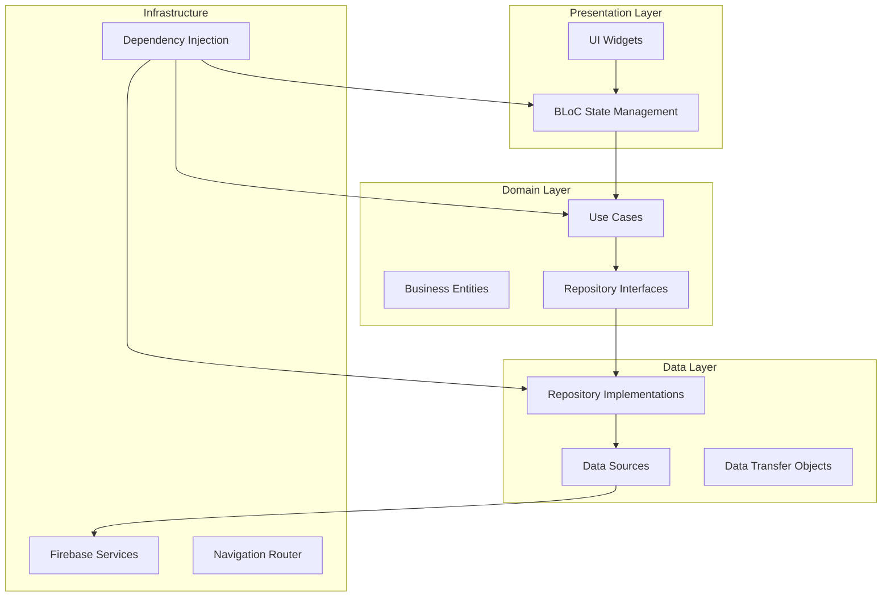
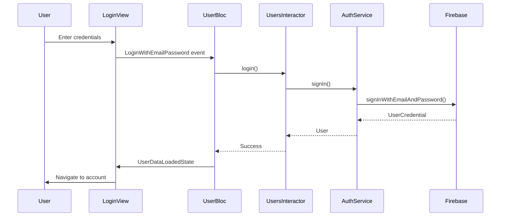

# Reverse Engineering Documentation - Judo Club Seclin

## Project Overview

**Project Name:** Judo Club Seclin  
**Version:** 1.0.0+18  
**Platform:** Flutter (Multi-platform: Web, Android, iOS, Desktop)  
**Backend:** Firebase (Firestore, Authentication, Functions, Hosting, Storage)  
**Architecture Pattern:** Clean Architecture with BLoC State Management  

## Project Structure Analysis

### Root Directory Structure
```
judoseclin/
├── app/                    # Flutter application
├── functions/              # Firebase Cloud Functions
├── firebase.json          # Firebase configuration
├── doc/                   # Documentation
├── images/                # Design assets
├── screenshots/           # App screenshots
└── platform-specific/     # Android, iOS, Windows, Linux, macOS
```

### Flutter App Structure (`app/`)
```
app/
├── lib/
│   ├── main.dart                    # Application entry point
│   ├── theme.dart                   # App theming
│   ├── configuration_locale.dart   # Locale configuration
│   ├── firebase_options.dart       # Firebase configuration
│   ├── core/                       # Core infrastructure
│   │   ├── di/                     # Dependency injection
│   │   ├── router/                 # Navigation routing
│   │   ├── services/               # Core services
│   │   └── utils/                  # Utility functions
│   ├── data/                       # Data layer
│   │   ├── dto/                    # Data transfer objects
│   │   └── repository/             # Repository implementations
│   ├── domain/                     # Domain layer
│   │   ├── entities/               # Business entities
│   │   └── usecases/               # Business use cases
│   └── ui/                         # Presentation layer
│       ├── account/                # User account management
│       ├── adherents/              # Member management
│       ├── competition/            # Competition management
│       ├── cotisations/            # Membership fees
│       ├── landing/                # Landing page
│       ├── members/                # Member authentication
│       ├── news/                   # News management
│       └── common/                 # Shared UI components
├── assets/                         # Static assets
│   ├── images/                     # Image assets
│   ├── fonts/                      # Custom fonts
│   ├── markdown/                   # Markdown content
│   └── documents/                  # Document templates
└── platform-specific/             # Platform configurations
```

## Architecture Overview

### Clean Architecture Implementation

The application follows Clean Architecture principles with clear separation of concerns:



### State Management Pattern

**BLoC (Business Logic Component) Pattern:**
- **Events:** User actions and system events
- **States:** UI state representations
- **BLoC:** Business logic processing
- **Interactors:** Bridge between BLoC and Domain layer

### Dependency Injection

**Injectable + GetIt Pattern:**
- `@injectable` annotations for automatic registration
- `@singleton` for single instance services
- Modular setup with separate modules for different features

## Core Components Analysis

### 1. Authentication System

**Location:** `app/lib/ui/members/`

**Components:**
- `LoginModule` - Login functionality
- `InscriptionModule` - User registration
- `ResetPasswordModule` - Password recovery
- `UserBloc` - Authentication state management
- `UsersInteractor` - Authentication business logic

**Flow:**


### 2. Member Management System

**Location:** `app/lib/ui/adherents/`

**Key Features:**
- Add new members
- View member details
- Generate PDF documents
- Family management
- Member categorization (Poussin, Benjamin, Minime, Cadet, Junior/Senior)

**Data Model:**
```dart
class Adherents {
  final String id;
  final String firstName, lastName, email;
  final String dateOfBirth, licence;
  final String? belt, discipline, boardPosition, category;
  final String phone, address, postalCode;
  final String image, sante, medicalCertificate, invoice;
  final String? familyId, additionalAddress;
}
```

### 3. Competition Management

**Location:** `app/lib/ui/competition/`

**Modules:**
- `ListCompetitionModule` - Competition listing
- `CompetitionDetailModule` - Competition details
- `AddCompetitionModule` - Competition creation
- `CompetitionRegistrationModule` - Member registration

**Competition Categories:**
- Poussin (youngest)
- Benjamin
- Minime  
- Cadet
- Junior/Senior (oldest)

Each category has minimum belt requirements and specific rules.

### 4. News Management

**Location:** `app/lib/ui/news/`

**Features:**
- Create news articles
- Markdown content support
- Publication date management
- Landing page integration

### 5. Financial Management

**Location:** `app/lib/ui/cotisations/`

**Features:**
- Membership fee tracking
- Multiple payment methods (checks, bank cards)
- PDF invoice generation
- Payment history

## Data Flow Architecture

### Firebase Integration

**Services Used:**
- **Firestore:** NoSQL database for all application data
- **Authentication:** Email/password authentication
- **Storage:** File storage for images and documents
- **Functions:** Email sending functionality
- **Hosting:** Web application hosting

**Collections Structure:**
```
Firestore Collections:
├── adherents/          # Member information
├── competitions/       # Competition data
├── competition_registration/  # Competition registrations
├── cotisations/        # Membership fees
├── news/              # News articles
├── users/             # User authentication data
└── Users/             # Admin user data (note: different from 'users')
```

### Navigation Architecture

**Router:** GoRouter with modular route configuration

**Route Structure:**
```
Routes:
├── /                           # Landing page
├── /login                      # User login
├── /inscription                # User registration
├── /account                    # User account
├── /adherents/:id              # Member details
├── /admin/adherents/:id        # Admin member view
├── /admin/add/cotisation/:id   # Add membership fee
└── /competitions/*             # Competition routes
```

## External Dependencies

### Core Flutter Dependencies
- `flutter_bloc: ^9.1.1` - State management
- `go_router: ^16.2.1` - Navigation
- `get_it: ^8.2.0` - Dependency injection
- `injectable: ^2.5.1` - DI annotations

### Firebase Dependencies
- `firebase_core: ^4.1.0` - Firebase initialization
- `firebase_auth: ^6.0.2` - Authentication
- `cloud_firestore: ^6.0.1` - Database
- `firebase_storage: ^13.0.1` - File storage
- `cloud_functions: ^6.0.1` - Cloud functions

### UI/UX Dependencies
- `flutter_markdown: ^0.7.7+1` - Markdown rendering
- `carousel_slider: ^5.1.1` - Image carousels
- `flutter_spinkit: ^5.2.2` - Loading indicators

### Utility Dependencies
- `http: ^1.5.0` - HTTP requests
- `url_launcher: ^6.3.2` - External URL handling
- `pdf: ^3.11.3` - PDF generation
- `printing: ^5.14.2` - PDF printing
- `intl: ^0.20.2` - Internationalization

## Security Implementation

### Authentication Security
- Firebase Authentication with email/password
- User session management
- Admin role verification through Firestore

### Data Access Control
- **Critical Issue:** No Firestore security rules found
- Direct database access from client
- Admin verification done client-side

### API Security
- Firebase Functions with CORS enabled
- Secret management for SMTP credentials
- Input validation in Cloud Functions

## Performance Considerations

### State Management
- BLoC pattern for predictable state updates
- Stream-based data loading
- Proper disposal of resources

### Data Loading
- Stream-based real-time updates from Firestore
- Pagination not implemented (potential performance issue)
- Image loading optimization needed

### Build Configuration
- Multi-platform support configured
- Web-specific optimizations present
- Asset optimization configured

## Integration Points

### Email System
- Firebase Functions with Nodemailer
- SMTP configuration via Firebase secrets
- HTML email templates

### PDF Generation
- Client-side PDF generation
- Document templates for invoices
- Print functionality integration

### File Management
- Firebase Storage integration
- Image upload and retrieval
- Document storage for certificates

This documentation provides a comprehensive overview of the application's architecture, data flow, and technical implementation. The next sections will detail specific findings and recommendations.
