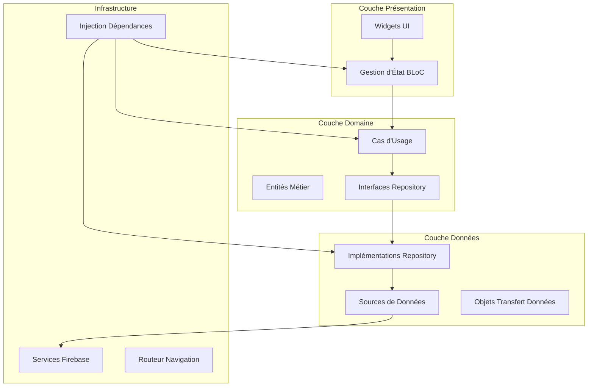
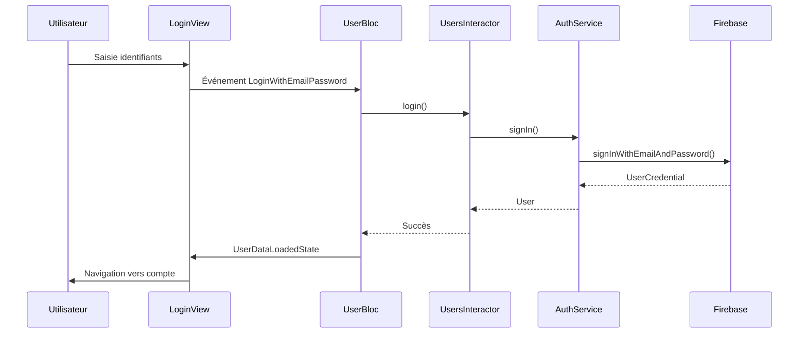
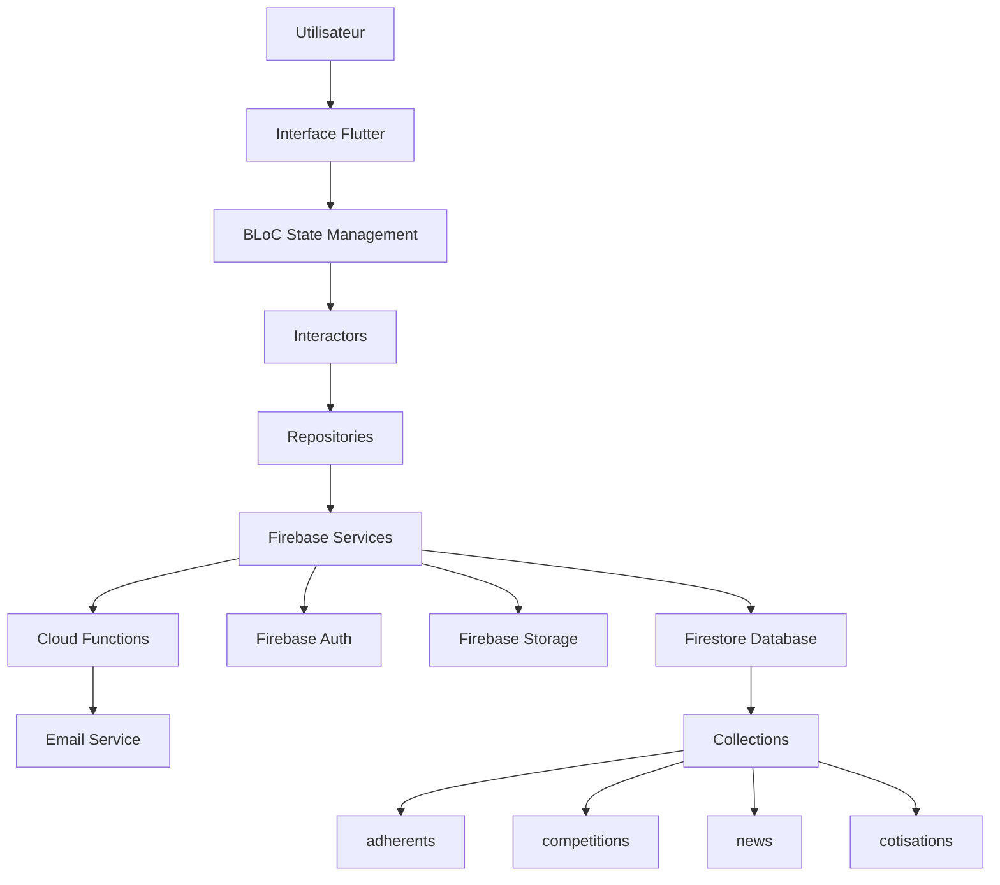
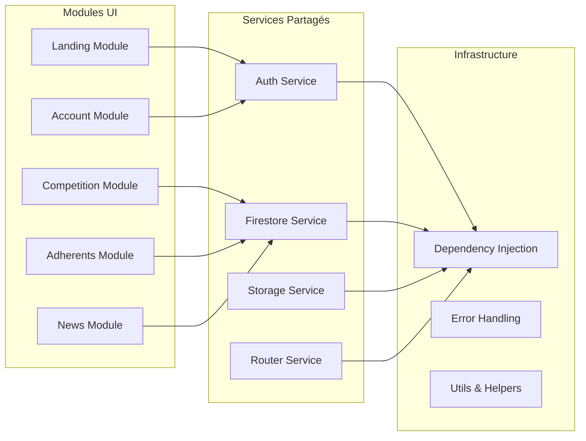

# Documentation de Rétro-Ingénierie - Judo Club Seclin

## Vue d'ensemble du Projet

**Nom du Projet :** Judo Club Seclin  
**Version :** 1.0.0+18  
**Plateforme :** Flutter (Multi-plateforme : Web, Android, iOS, Desktop)  
**Backend :** Firebase (Firestore, Authentication, Functions, Hosting, Storage)  
**Pattern Architectural :** Clean Architecture avec Gestion d'État BLoC  

## Analyse de la Structure du Projet

### Structure du Répertoire Racine
```
judoseclin/
├── app/                    # Application Flutter
├── functions/              # Firebase Cloud Functions
├── firebase.json          # Configuration Firebase
├── doc/                   # Documentation
├── images/                # Assets de design
├── screenshots/           # Captures d'écran de l'app
└── platform-specific/     # Android, iOS, Windows, Linux, macOS
```

### Structure de l'App Flutter (`app/`)
```
app/
├── lib/
│   ├── main.dart                    # Point d'entrée de l'application
│   ├── theme.dart                   # Thème de l'app
│   ├── configuration_locale.dart   # Configuration locale
│   ├── firebase_options.dart       # Configuration Firebase
│   ├── core/                       # Infrastructure centrale
│   │   ├── di/                     # Injection de dépendances
│   │   ├── router/                 # Routage de navigation
│   │   ├── services/               # Services centraux
│   │   └── utils/                  # Fonctions utilitaires
│   ├── data/                       # Couche de données
│   │   ├── dto/                    # Objets de transfert de données
│   │   └── repository/             # Implémentations de repository
│   ├── domain/                     # Couche domaine
│   │   ├── entities/               # Entités métier
│   │   └── usecases/               # Cas d'usage métier
│   └── ui/                         # Couche présentation
│       ├── account/                # Gestion compte utilisateur
│       ├── adherents/              # Gestion des adhérents
│       ├── competition/            # Gestion des compétitions
│       ├── cotisations/            # Cotisations
│       ├── landing/                # Page d'accueil
│       ├── members/                # Authentification membres
│       ├── news/                   # Gestion des actualités
│       └── common/                 # Composants UI partagés
├── assets/                         # Assets statiques
│   ├── images/                     # Assets d'images
│   ├── fonts/                      # Polices personnalisées
│   ├── markdown/                   # Contenu markdown
│   └── documents/                  # Modèles de documents
└── platform-specific/             # Configurations plateforme
```

## Vue d'ensemble de l'Architecture

### Implémentation Clean Architecture

L'application suit les principes de Clean Architecture avec une séparation claire des responsabilités :



### Pattern de Gestion d'État

**Pattern BLoC (Business Logic Component) :**
- **Events :** Actions utilisateur et événements système
- **States :** Représentations d'état UI
- **BLoC :** Traitement de la logique métier
- **Interactors :** Pont entre BLoC et couche Domaine

### Injection de Dépendances

**Pattern Injectable + GetIt :**
- Annotations `@injectable` pour enregistrement automatique
- `@singleton` pour services instance unique
- Configuration modulaire avec modules séparés par fonctionnalité

## Analyse des Composants Centraux

### 1. Système d'Authentification

**Emplacement :** `app/lib/ui/members/`

**Composants :**
- `LoginModule` - Fonctionnalité de connexion
- `InscriptionModule` - Inscription utilisateur
- `ResetPasswordModule` - Récupération mot de passe
- `UserBloc` - Gestion d'état authentification
- `UsersInteractor` - Logique métier authentification

**Flux :**


### 2. Système de Gestion des Adhérents

**Emplacement :** `app/lib/ui/adherents/`

**Fonctionnalités Clés :**
- Ajout nouveaux adhérents
- Consultation détails adhérent
- Génération documents PDF
- Gestion familiale
- Catégorisation adhérents (Poussin, Benjamin, Minime, Cadet, Junior/Senior)

**Modèle de Données :**
```dart
class Adherents {
  final String id;
  final String firstName, lastName, email;
  final String dateOfBirth, licence;
  final String? belt, discipline, boardPosition, category;
  final String phone, address, postalCode;
  final String image, sante, medicalCertificate, invoice;
  final String? familyId, additionalAddress;
}
```

### 3. Gestion des Compétitions

**Emplacement :** `app/lib/ui/competition/`

**Modules :**
- `ListCompetitionModule` - Liste des compétitions
- `CompetitionDetailModule` - Détails compétition
- `AddCompetitionModule` - Création compétition
- `CompetitionRegistrationModule` - Inscription adhérents

**Catégories de Compétition :**
- Poussin (plus jeunes)
- Benjamin
- Minime  
- Cadet
- Junior/Senior (plus âgés)

Chaque catégorie a des exigences de ceinture minimum et règles spécifiques.

### 4. Gestion des Actualités

**Emplacement :** `app/lib/ui/news/`

**Fonctionnalités :**
- Création articles actualités
- Support contenu Markdown
- Gestion date publication
- Intégration page d'accueil

### 5. Gestion Financière

**Emplacement :** `app/lib/ui/cotisations/`

**Fonctionnalités :**
- Suivi cotisations adhérents
- Méthodes paiement multiples (chèques, cartes bancaires)
- Génération factures PDF
- Historique paiements

## Architecture de Flux de Données

### Intégration Firebase

**Services Utilisés :**
- **Firestore :** Base de données NoSQL pour toutes les données application
- **Authentication :** Authentification email/mot de passe
- **Storage :** Stockage fichiers pour images et documents
- **Functions :** Fonctionnalité envoi email
- **Hosting :** Hébergement application web

**Structure Collections :**
```
Collections Firestore :
├── adherents/          # Informations adhérents
├── competitions/       # Données compétitions
├── competition_registration/  # Inscriptions compétitions
├── cotisations/        # Cotisations
├── news/              # Articles actualités
├── users/             # Données authentification utilisateur
└── Users/             # Données utilisateur admin (note: différent de 'users')
```

### Architecture de Navigation

**Routeur :** GoRouter avec configuration route modulaire

**Structure Routes :**
```
Routes :
├── /                           # Page d'accueil
├── /login                      # Connexion utilisateur
├── /inscription                # Inscription utilisateur
├── /account                    # Compte utilisateur
├── /adherents/:id              # Détails adhérent
├── /admin/adherents/:id        # Vue admin adhérent
├── /admin/add/cotisation/:id   # Ajout cotisation
└── /competitions/*             # Routes compétitions
```

## Dépendances Externes

### Dépendances Flutter Centrales
- `flutter_bloc: ^9.1.1` - Gestion d'état
- `go_router: ^16.2.1` - Navigation
- `get_it: ^8.2.0` - Injection dépendances
- `injectable: ^2.5.1` - Annotations DI

### Dépendances Firebase
- `firebase_core: ^4.1.0` - Initialisation Firebase
- `firebase_auth: ^6.0.2` - Authentification
- `cloud_firestore: ^6.0.1` - Base de données
- `firebase_storage: ^13.0.1` - Stockage fichiers
- `cloud_functions: ^6.0.1` - Cloud functions

### Dépendances UI/UX
- `flutter_markdown: ^0.7.7+1` - Rendu Markdown
- `carousel_slider: ^5.1.1` - Carrousels d'images
- `flutter_spinkit: ^5.2.2` - Indicateurs chargement

### Dépendances Utilitaires
- `http: ^1.5.0` - Requêtes HTTP
- `url_launcher: ^6.3.2` - Gestion URLs externes
- `pdf: ^3.11.3` - Génération PDF
- `printing: ^5.14.2` - Impression PDF
- `intl: ^0.20.2` - Internationalisation

## Implémentation Sécurité

### Sécurité Authentification
- Authentification Firebase avec email/mot de passe
- Gestion sessions utilisateur
- Vérification rôle admin via Firestore

### Contrôle Accès Données
- **Problème Critique :** Aucune règle sécurité Firestore trouvée
- Accès direct base de données depuis client
- Vérification admin côté client uniquement

### Sécurité API
- Firebase Functions avec CORS activé
- Gestion secrets pour identifiants SMTP
- Validation entrées dans Cloud Functions

## Considérations Performance

### Gestion d'État
- Pattern BLoC pour mises à jour état prévisibles
- Chargement données basé sur streams
- Libération appropriée des ressources

### Chargement Données
- Mises à jour temps réel basées sur streams depuis Firestore
- Pagination non implémentée (problème performance potentiel)
- Optimisation chargement images nécessaire

### Configuration Build
- Support multi-plateforme configuré
- Optimisations spécifiques web présentes
- Optimisation assets configurée

## Points d'Intégration

### Système Email
- Firebase Functions avec Nodemailer
- Configuration SMTP via secrets Firebase
- Modèles email HTML

### Génération PDF
- Génération PDF côté client
- Modèles documents pour factures
- Intégration fonctionnalité impression

### Gestion Fichiers
- Intégration Firebase Storage
- Upload et récupération images
- Stockage documents pour certificats

Cette documentation fournit une vue d'ensemble complète de l'architecture, du flux de données et de l'implémentation technique de l'application. Les sections suivantes détailleront les conclusions spécifiques et recommandations.

## Diagrammes Architecturaux Détaillés

### Flux de Données Global



### Architecture Modulaire



Cette architecture modulaire permet une maintenance facilitée et une évolutivité optimale du système.
