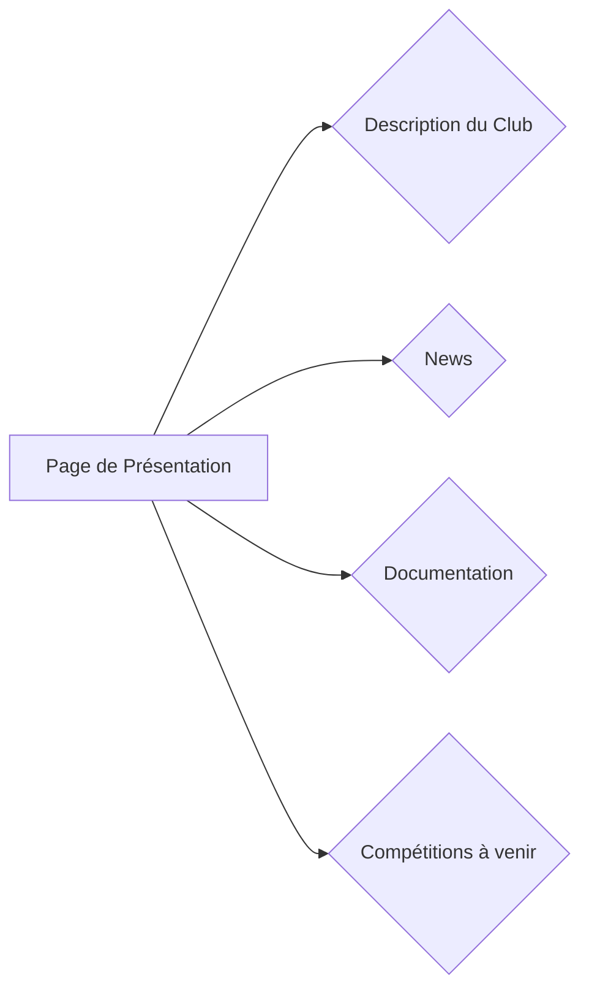
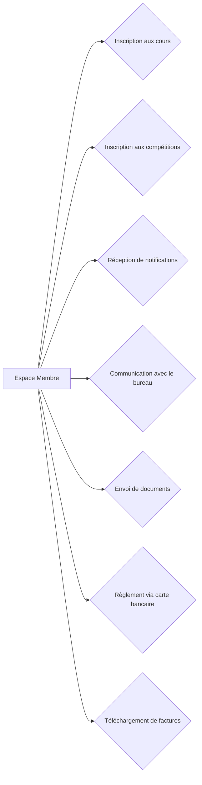
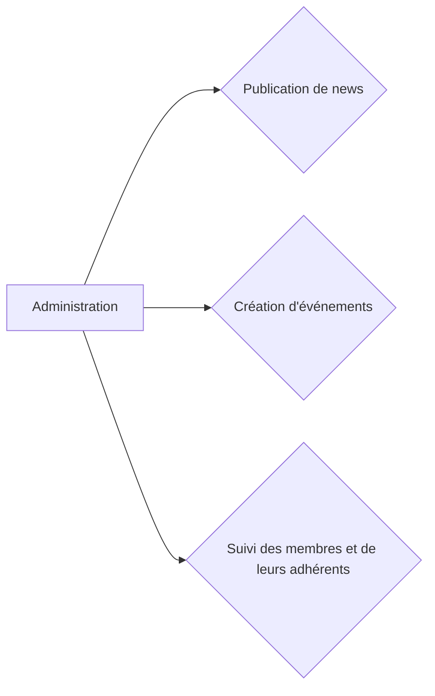
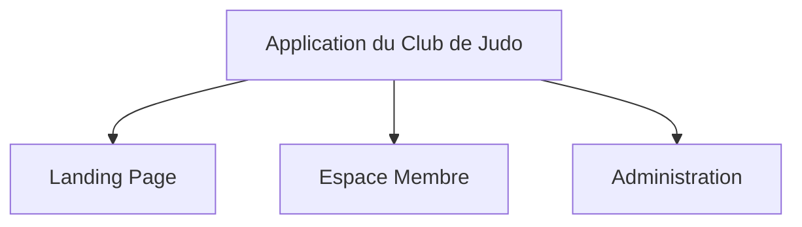

# Documentation Fonctionnelle

## Objectif

L'objectif de cette application est de présenter le Club de Judo, de fournir des informations et de permettre aux membres de gérer leur adhésion.

## Fonctionnalités

1. **Landing Page**
2. **Espace Membre**
3. **Administration**

### 1. Landing Page

La page de présentation servira d'introduction au club. Elle contiendra une description du club, les dernières nouvelles, la documentation et les compétitions à venir.

### 2. Espace Membre

L'Espace Membre permettra aux membres de gérer leur adhésion. Ils pourront s'inscrire eux-mêmes ou inscrire un membre de leur famille aux cours, s'inscrire aux compétitions, recevoir des notifications, communiquer avec le bureau, envoyer des documents, régler via carte bancaire et télécharger des factures.

### 3. Administration

L'administration permettra la publication de nouvelles, la création d'événements (compétitions), et le suivi des membres et de leurs adhérents.

## Schéma global de l'application

Cette documentation donne une vue globale de la façon dont l'application du Club de Judo sera structurée. Les différentes fonctionnalités permettront à la fois une gestion efficace du club par l'administration et une meilleure expérience pour les membres.