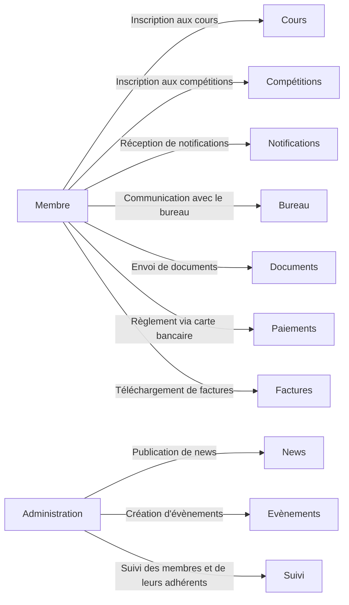
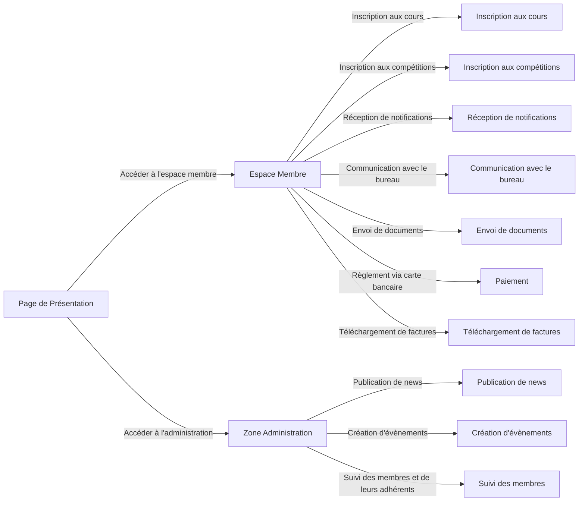
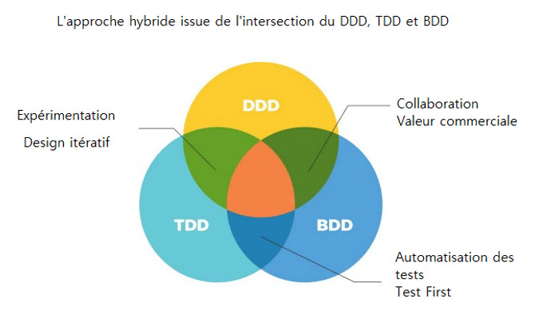
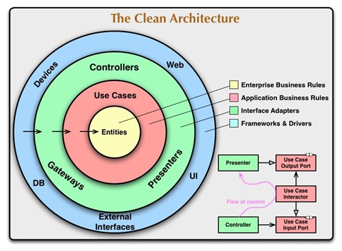

# Documentation technique

## Rappel du Besoin Fonctionnel

L'objectif principal de cette application est de fournir une plateforme complète de gestion et d'information pour les membres d'un club de judo. Les fonctionnalités requises, listées ci-dessous, couvrent divers aspects de l'administration du club et de l'engagement des membres.

### Landing Page
La page d'accueil doit fournir des informations détaillées sur le club, les actualités pertinentes, la documentation et les informations sur les compétitions à venir.

### Espace Membre
Cet espace doit permettre aux membres de s'inscrire eux-mêmes ou un membre de leur famille à des cours, de s'inscrire à des compétitions, de recevoir des notifications, de communiquer avec le bureau du club, d'envoyer des documents, de régler des frais par carte bancaire, et de télécharger des factures.

### Administration
Le côté administration de l'application doit permettre la publication de news, la création d'événements tels que les compétitions, et le suivi des membres et de leurs adhérents.

L'application doit donc être construite de manière à répondre à ces besoins, tout en étant facile à utiliser pour les utilisateurs et facile à gérer pour les administrateurs. La plateforme devrait également être conçue de manière à permettre des mises à jour et des améliorations futures. Les préoccupations clés pour l'architecture technique comprennent donc l'extensibilité, la performance, la sécurité et l'expérience utilisateur.

### Diagramme de cas d'utilisation

Le diagramme de cas d'utilisation illustre comment les utilisateurs (acteurs) interagissent avec le système (notre application).



### Diagramme de flux

Le diagramme de flux illustre comment les informations se déplacent à travers le système.




## Stacks techniques

Pour fournir quelque chose de fonctionnel au plus vite et expérimenter quelques designs, nous avons créé une première page web.

### Dart / Flutter

**Dart** est un langage de programmation orienté objet, développé par Google, qui peut être utilisé pour développer des applications sur une variété de plates-formes. Il a été conçu pour la performance, et est compilé "just-in-time" (JIT) pour le développement rapide et "ahead-of-time" (AOT) pour une exécution rapide en production. Dart est utilisé pour créer des applications web, des serveurs, et des applications mobiles pour iOS et Android.

Quelques caractéristiques de Dart incluent :

- **Support pour les types statiques et dynamiques**: Dart est un langage à types sûrs, ce qui signifie que le type de chaque variable est connu au moment de la compilation. Cependant, vous pouvez aussi choisir d'utiliser des types dynamiques si vous le souhaitez.
- **Collections intégrées**: Dart a des support pour les collections comme List, Set et Map directement intégrées dans le langage.
- **Gestion de la mémoire automatique**: Dart utilise un ramasse-miettes pour la gestion de la mémoire, ce qui signifie que vous n'avez pas besoin de libérer explicitement la mémoire utilisée par vos objets.

**Flutter** est un framework de développement d'applications mobiles open source, également créé par Google, qui utilise Dart pour développer des applications. Il a été conçu pour créer des applications belles et performantes qui fonctionnent à la fois sur iOS et Android à partir d'une seule base de code.

Avec Flutter, vous pouvez avoir un contrôle total sur chaque pixel de l'écran, et il inclut des widgets qui suivent les directives de Material Design de Google et Cupertino d'Apple, vous permettant de créer des applications qui ont l'air et se comportent de manière native sur les deux plateformes.

Quelques caractéristiques de Flutter incluent :

- **Hot Reload**: Flutter offre une fonctionnalité de rechargement à chaud, qui vous permet de voir les modifications de votre code presque immédiatement dans l'application en cours d'exécution, sans avoir à redémarrer l'application.
- **Widgets**: L'interface utilisateur dans Flutter est construite à partir de widgets, qui sont des blocs de construction modulaires et réutilisables qui peuvent inclure des éléments de l'interface utilisateur ainsi que des fonctionnalités, comme la gestion de l'état ou des animations.
- **Performance**: Parce que Flutter est compilé en code natif, il a une performance comparable à celle d'une application écrite en Swift pour iOS ou en Java/Kotlin pour Android.
- **Interopérabilité avec le code natif**: Flutter permet d'appeler le code natif iOS ou Android, ce qui est particulièrement utile lorsque vous utilisez une fonctionnalité de plate-forme spécifique non couverte par le framework Flutter lui-même.
- **Support pour le web et le desktop**: Bien que Flutter ait été initialement conçu pour le développement mobile, Google travaille également sur le support pour le développement d'applications web et desktop avec Flutter. Ces fonctionnalités sont toujours en cours de développement au moment de la rédaction de cet article.

### BLoC (Business Logic Component)

Le pattern BLoC (Business Logic Component) est un modèle de conception conçu par Google pour séparer la logique d'affaires (business logic) de l'interface utilisateur dans les applications Flutter. Ce modèle a été introduit pour la première fois lors de la Dart Conference 2018.

L'idée clé derrière BLoC est de rendre le code plateforme-indépendant, en permettant de partager la même logique d'affaires entre plusieurs plateformes, comme Flutter et AngularDart. Le modèle BLoC est basé sur les flux de données entrantes (inputs) et sortantes (outputs) : les événements entrent dans le BLoC et les états en sortent.

Le pattern BLoC utilise les streams de Dart pour gérer les flux de données, et le package RxDart pour gérer la combinaison et la transformation des streams.

**Flutter BLoC : Cubit**

Le Cubit est une version plus simple du BLoC. Un Cubit ne reçoit pas d'événements externes comme un BLoC, à la place, il expose des fonctions qui peuvent être appelées directement pour émettre de nouveaux états. Chaque fonction représente une certaine action qui peut être effectuée par le Cubit, et chaque action émet un nouvel état.

Voici un exemple de code d'un Cubit :

```dart
class CounterCubit extends Cubit<int> {
  CounterCubit() : super(0);

  void increment() => emit(state + 1);
  void decrement() => emit(state - 1);
}
```

Dans cet exemple, le `CounterCubit` expose deux fonctions, `increment` et `decrement`, qui émettent un nouvel état chaque fois qu'elles sont appelées.

Pour organiser nos fichiers, nous prodèreons comme suit :

```
lib/
  ui/
    counter/
      view/
        counter_page.dart
        counbter_view.dart
      counter_cubit.dart
      counter_interactor.dart
```

L'interactor est une classe de transition entre le Cubit et le Domain. Il permet de séparer la logique métier de la logique d'interface.

**Flutter BLoC : Flows**

En ce qui concerne le BLoC complet, il repose sur le concept de flux d'événements. Le BLoC reçoit les événements via un `Stream`, et réagit à ces événements en émettant de nouveaux états.

Chaque événement est traité par une fonction `mapEventToState` qui est définie dans le BLoC. Cette fonction est appelée chaque fois qu'un nouvel événement est ajouté au `Stream` d'événements. Elle prend l'événement actuel et l'état actuel du BLoC, effectue une logique d'affaires et renvoie un nouvel état.

Voici un exemple de code d'un BLoC :

```dart
class CounterBloc extends Bloc<CounterEvent, int> {
  CounterBloc() : super(0);

  @override
  Stream<int> mapEventToState(CounterEvent event) async* {
    switch (event) {
      case CounterEvent.increment:
        yield state + 1;
        break;
      case CounterEvent.decrement:
        yield state - 1;
        break;
    }
  }
}
```

Dans cet exemple, le `CounterBloc` reçoit les événements `CounterEvent.increment` et `CounterEvent.decrement` et émet un nouvel état en fonction de l'événement reçu.

Pour organiser nos fichiers, nous prodèreons comme suit :

```
lib/
  ui/
    counter/
      view/
        counter_page.dart
        counbter_view.dart
      counter_bloc.dart
      counter_event.dart
      counter_state.dart
      counter_interactor.dart
```

L'interactor est une classe de transition entre le BLoC et le Domain. Il permet de séparer la logique métier de la logique d'interface.

### Firebase

Firebase est une plateforme de développement d'applications mobiles et Web développée par Google. Elle fournit une variété de services qui aident les développeurs à construire, améliorer et développer des applications de haute qualité. Ces services comprennent l'authentification, le stockage en nuage, l'hébergement, la base de données en temps réel, les analytics, les notifications, le crash reporting, et bien plus encore. Firebase offre une intégration facile avec Android, iOS et le Web, et fonctionne particulièrement bien avec Flutter.

**1. firebase_core :**

Ce package est nécessaire pour toute application qui utilise Firebase. Il fournit les fonctionnalités de base nécessaires pour initialiser et configurer Firebase. Il est généralement installé en premier.

**2. firebase_auth :**

Ce package permet d'implémenter l'authentification dans votre application. Il prend en charge un certain nombre de méthodes d'authentification, y compris l'authentification par e-mail/mot de passe, l'authentification par téléphone, Google Sign-In, et bien plus encore.

**3. cloud_firestore :**

Ce package permet d'interagir avec Cloud Firestore, une base de données NoSQL flexible, évolutive et en temps réel pour le développement d'applications mobiles, web et serveur de Google Cloud Platform.

**4. firebase_storage :**

Ce package permet d'interagir avec Firebase Cloud Storage, qui est utilisé pour stocker et servir les fichiers utilisateur comme les images, l'audio, la vidéo, etc.

**5. firebase_messaging :**

Ce package permet d'implémenter les notifications push dans votre application via Firebase Cloud Messaging.

**6. firebase_crashlytics :**

Ce package permet d'implémenter la collecte de données de crash dans votre application via Firebase Crashlytics. Crashlytics vous aide à suivre, à prioriser et à résoudre les problèmes de stabilité qui améliorent la qualité de votre application.

**7. firebase_analytics :**

Ce package permet d'implémenter la collecte de données d'analyse d'utilisation de l'application via Google Analytics pour Firebase. Google Analytics vous aide à comprendre comment les utilisateurs interagissent avec votre application.

**8. firebase_dynamic_links :**

Ce package permet d'utiliser les liens dynamiques de Firebase. Les liens dynamiques sont des URL qui fonctionnent sur tous les appareils et peuvent mener à n'importe quelle localisation de votre application iOS ou Android.

### Injection de dépendance

L'injection de dépendance (DI) est un patron de conception très utilisé en programmation orientée objet. L'idée principale est de déléguer la gestion des dépendances d'une classe à une autre entité, généralement un conteneur d'injection de dépendances. En faisant cela, une classe n'a plus besoin de créer directement ses dépendances, mais elle les reçoit au moment de la création (généralement via le constructeur), ce qui favorise un couplage faible, une meilleure testabilité et une meilleure modularité du code.

Voici un exemple de code avec et sans DI :

```dart
// Sans DI
class WithoutDI {
  Database database = Database();

  void saveData(Data data) {
    database.save(data);
  }
}

// Avec DI
class WithDI {
  Database database;

  WithDI(this.database);

  void saveData(Data data) {
    database.save(data);
  }
}
```

Dans l'exemple "WithoutDI", la classe crée directement sa dépendance vers la classe Database, ce qui rend difficile la substitution de cette dépendance, par exemple par un mock dans un test. Au contraire, dans l'exemple "WithDI", la dépendance est injectée via le constructeur, permettant une meilleure flexibilité.

### GetIt en Flutter

GetIt est un simple conteneur d'injection de dépendance pour Dart et Flutter, ce qui signifie qu'il sert de registre pour les instances de différentes classes que vous pouvez accéder de n'importe où dans votre code.

Pour utiliser GetIt, vous devez suivre ces étapes :

1. **Créez une instance de GetIt** : C'est généralement fait en déclarant une variable globale.

    ```dart
    GetIt getIt = GetIt.instance;
    ```

2. **Enregistrez vos services ou blocs** : Vous devez enregistrer vos dépendances. Cela peut être fait dans la fonction `main()` ou dans une fonction dédiée.

    ```dart
    void setup() {
      getIt.registerSingleton<Database>(DatabaseImplementation());
      getIt.registerFactory<WithDI>(() => WithDI(getIt<Database>()));
    }
    ```

   Dans cet exemple, nous enregistrons une instance de `DatabaseImplementation` en tant que singleton, ce qui signifie que chaque fois que nous demandons à GetIt une instance de `Database`, il nous retournera toujours la même instance. De plus, nous enregistrons un "factory" pour `WithDI`, ce qui signifie que chaque fois que nous demandons à GetIt une instance de `WithDI`, il crée une nouvelle instance en utilisant la fonction de factory que nous avons fournie.

3. **Accédez à vos dépendances** : Lorsque vous avez besoin d'une de vos dépendances, vous pouvez simplement demander à GetIt.

    ```dart
    WithDI withDI = getIt<WithDI>();
    ```

   Dans cet exemple, nous obtenons une instance de `WithDI` à partir de GetIt. GetIt s'occupe de fournir les dépendances correctes à `WithDI`, dans ce cas, une instance de `Database`.

En conclusion, GetIt est une bibliothèque puissante qui permet d'implémenter facilement l'injection de dépendance en Dart et Flutter, favorisant un code plus modulaire, plus testable et plus réutilisable.

### Gherkin et `bdd_widget_test`

Gherkin est un langage qui sert à écrire des scénarios structurés de tests d'acceptation, en langage naturel. Il est couramment utilisé dans le cadre de la méthodologie de développement Behavior-Driven Development (BDD), ou Développement piloté par le comportement.

Chaque scénario de test est une liste d'étapes, écrite dans un langage naturel, qui décrit un comportement de l'application. Le principal avantage de Gherkin est qu'il est lisible par l'homme et qu'il sert à la fois de documentation et de base de tests automatiques.

Une spécification Gherkin est constituée de plusieurs éléments de base :

1. **Feature (Fonctionnalité)** : Elle sert à décrire une fonctionnalité logicielle et le contexte associé. Chaque fichier `.feature` commence généralement par cet élément.

2. **Scenario (Scénario)** : Il sert à décrire une situation de test spécifique ou un cas d'utilisation.

3. **Given, When, Then, And, But (Étant donné, Quand, Alors, Et, Mais)** : Ce sont les étapes d'un scénario. Ils servent à décrire une séquence d'événements.

Voici un exemple de spécification Gherkin :

```
Feature: Login fonctionnel

  Scénario: Utilisateur se connecte avec succès
    Étant donné que je suis sur la page de connexion
    Quand j'entre un nom d'utilisateur valide et un mot de passe correct
    Et je clique sur le bouton de connexion
    Alors je devrais être redirigé vers la page d'accueil

  Scénario: Échec de la connexion de l'utilisateur
    Étant donné que je suis sur la page de connexion
    Quand j'entre un nom d'utilisateur invalide et un mot de passe incorrect
    Et je clique sur le bouton de connexion
    Alors un message d'erreur devrait s'afficher
```

En plus d'être facile à lire et à comprendre, Gherkin favorise la communication entre les membres non techniques et techniques d'une équipe, ce qui aide à clarifier les exigences et les attentes dès le début du cycle de développement.

Gherkin peut être utilisé avec des outils comme Cucumber, SpecFlow ou Behat pour automatiser l'exécution des scénarios et vérifier qu'ils passent sur le logiciel réel.

`bdd_widget_test` est un package qui permet d'écrire des tests d'interface utilisateur en utilisant Gherkin. Il est basé sur le package `flutter_gherkin`, qui fournit les fonctionnalités de base pour écrire des tests Gherkin en Flutter.

Pour utiliser `bdd_widget_test`, vous devez suivre ces étapes :

**Écrire des fonctionnalités**

Créez un fichier `*.feature` dans le dossier `test`. Supposons que vous testiez l'application de compteur Flutter par défaut, le contenu pourrait être le suivant :
```ruby
Feature: Counter
    Scenario: Initial counter value is 0
        Given the app is running
        Then I see {'0'} text
```

Demandez maintenant à `built_value` de générer des fichiers Dart pour vous. Vous pouvez le faire avec la commande :
```
flutter packages pub run build_runner watch --delete-conflicting-outputs
```
Après cela, le fichier `dart` correspondant sera généré pour chacun de vos fichiers `feature`. Ne modifiez pas le code à l'intérieur de ces fichiers `dart` car **ils seront recréés** chaque fois que vous modifiez quelque chose dans les fichiers de fonctionnalité.

Pendant la génération de feature-to-dart, un dossier `step` supplémentaire sera créé. Il contiendra toutes les étapes nécessaires pour exécuter le scénario. **Ces fichiers ne seront pas mis à jour** donc n'hésitez pas à adapter le contenu selon vos besoins.

**Exécutez les tests**

Vous êtes prêt à partir ! `bdd_widget_test` a généré de simples anciens tests Dart, alors n'hésitez pas à exécuter vos tests dans votre IDE ou en utilisant la commande suivante
```
flutter test
```

**Syntaxe du fichier Feature**

Exemple de fichier Feature :
```ruby
# comment here

Feature: Counter

  Background:
    Given the answer is {42}

  After:
    Then clean up after the test

  Scenario: Initial counter value is 0
    Given the app is running
    Then I see {'0'} text

  Scenario: Plus button increases the counter
    Given the app is running
    When I tap {Icons.add} icon
    Then I see {'1'} text
```

Les sections `Background` et `After` sont optionnelles. Un `Background` vous permet d'ajouter un contexte aux scénarios qui le suivent. Il peut contenir une ou plusieurs étapes Given, qui sont exécutées avant chaque scénario. Un scénario `After` s'exécute même si un test échoue, pour s'assurer qu'il a une chance de se nettoyer après lui-même. Vous n'avez probablement pas besoin d'utiliser ce mot-clé.

Chaque fichier de fonctionnalité doit avoir une ou plusieurs `Feature:`. Les fonctionnalités deviennent des groupes de tests dans les tests Flutter.

Chaque groupe de fonctionnalités doit avoir un ou plusieurs `Scenario:` (ou `Example:`). Le scénario devient des tests de widget.

Chaque scénario doit avoir une ou plusieurs lignes avec des étapes. Chacun d'eux doit commencer par les mots-clés `Given`, `When`, `Then`, `And`, ou `But`. Conventionnellement, les étapes `Given` sont utilisées pour les arrangements de test, `When` - pour l'interaction, `Then` - pour les affirmations. Les mots-clés ne sont pas pris en compte lors de la recherche d'une définition d'étape.
Vous pouvez avoir autant d'étapes que vous le souhaitez, mais il est recommandé de garder le nombre à 3-5 par scénario. Avoir trop d'étapes fera perdre à celle-ci son pouvoir expressif en tant que spécification et documentation.

Le mot-clé `Scenario Outline` peut être utilisé pour exécuter le même `Scenario` plusieurs fois, avec différentes combinaisons de valeurs.

Un Scenario Outline doit contenir une section `Examples` (ou `Scenarios`). Ses étapes sont interprétées comme un modèle qui n'est jamais exécuté directement. Au lieu de cela, le Scenario Outline est exécuté une fois pour chaque ligne de la section Examples sous lui (ne comptant pas la première ligne d'en-tête).

Les étapes peuvent utiliser des paramètres délimités par `<>` qui font référence aux en-têtes dans le tableau des exemples. Le plugin remplacera ces paramètres par des valeurs du tableau avant d'essayer de faire correspondre l'étape à une définition d'étape.

Exemple de Scenario Outline :
```ruby
Feature: Sample

  Scenario Outline: Plus button increases the counter
    Given the app is running
    When I tap {Icons.add} icon <times> times
    Then I see <result> text

    Examples:
    | times | result |
    |    0  |   '0'  |
    |    1  |   '1'  |
    |   42  |  '42'  |
```

Si vous avez besoin d'avoir la même étape mais avec des paramètres différents, vous pouvez utiliser une syntaxe de type `DataTable` :
```ruby
Feature: Sample

  Scenario: An answer
    Given the app is running
    When I enter <input> text into <field> text field
    | input      | field |
    | '42'       |   0  |
    | 'question' |   1  |
    Then I see {'Do not forget your towel!'} text
```
Ce qui précède est équivalent à :
```ruby
Feature: Sample

  Scenario: An answer
    Given the app is running
    When I enter {'42'} text into {0} text field
    And I enter {'question'} text into {1} text field
    Then I see {'Do not forget your towel!'} text
```

**Balises**

Les balises sont utilisées pour filtrer les scénarios dans le coureur de test. Voici quelques exemples :
```ruby
@slow
@integration
Feature: Sample

  @important
  Scenario: An answer
    Given the app is running
```

Ici, nous marquons le test comme `slow`, `integration`, et `important`.

Pour exécuter des tests qui sont marqués avec la balise `@important`, vous pouvez utiliser la commande suivante :
```sh
flutter test --tags important
```
Pour exclure les tests qui sont marqués avec la balise `@slow`, vous pouvez utiliser la commande suivante :
```sh
flutter test --exclude-tags slow
```

**Étapes prédéfinies**

Cette bibliothèque est livrée avec une liste d'étapes prédéfinies. Elles seront générées automatiquement pour vous, mais vous pouvez vouloir ajuster leur mise en œuvre en fonction de vos besoins.

Liste des étapes prédéfinies :
* I dismiss the page
* I don't see {..} icon
* I don't see {..} rich text
* I don't see {..} text
* I don't see {..} widget
* I enter {..} into {..} input field
* I see disabled elevated button
* I see enabled elevated button
* I see exactly {..} {..} widgets
* I see {..} icon
* I see multiple {..} texts
* I see multiple {..} widgets
* I see {..} rich text
* I see {..} text
* I tap {..} icon
* I tap {..} text
* The app is running

Si vous souhaitez utiliser des étapes prédéfinies sans les avoir dans votre dossier `steps`, vous pouvez créer un fichier `build.yaml` à la racine de votre projet avec le contenu suivant (voir le dossier `example`) :
```yaml
targets:
  $default:
    builders:
      bdd_widget_test|featureBuilder:
        options:
          externalSteps:
            - package:bdd_widget_test/step/i_see_text.dart
            - package:bdd_widget_test/step/i_dont_see_text.dart
            - package:bdd_widget_test/step/i_see_multiple_texts.dart
            - package:bdd_widget_test/step/i_tap_text.dart
            - package:bdd_widget_test/step/i_see_icon.dart
            - package:bdd_widget_test/step/i_dont_see_icon.dart
            - package:bdd_widget_test/step/i_tap_icon.dart
            - package:bdd_widget_test/step/i_see_rich_text.dart
            - package:bdd_widget_test/step/i_dont_see_rich_text.dart
            - package:bdd_widget_test/step/i_see_widget.dart
            - package:bdd_widget_test/step/i_dont_see_widget.dart
            - package:bdd_widget_test/step/i_see_exactly_widgets.dart
            - package:bdd_widget_test/step/i_see_multiple_widgets.dart
            - package:bdd_widget_test/step/i_enter_into_input_field.dart
            - package:bdd_widget_test/step/i_see_disabled_elevated_button.dart
            - package:bdd_widget_test/step/i_see_enabled_elevated_button.dart
            - package:bdd_widget_test/step/i_wait.dart
            - package:bdd_widget_test/step/i_dismiss_the_page.dart
```
Cela indiquera au plugin de réutiliser les étapes du plugin lui-même et de ne pas les intégrer à votre code.

## Nos pratiques

Pour une qualité et une lisibilité optimale du code, pour un code réellement adapté au besoin et, enfin, pour un code avec une quantité minimale de bug/vulnérabilité, et ce, quelque soit la technologie, il nous faut des outils techniques mais aussi méthodologiques.

Pour la technique, l'indispensable et le minimum à avoir sont :

- Un IDE (VSCode, Android Studio, IntelliJ, etc.)
- Un linter (TSLint, StyleLint, DartLint, etc.)
- Un language ou superset typé

Pour la méthodologie, vous trouverez tout ce qu'il ci-dessous.

### TDD (Test Driven Development)

Le TDD (Développement piloté par les tests en français) est une méthode de développement qui consiste à réaliser les tests avant d'écrire le code de production.

Le principe est simple :

1. On écrit un test qui correspond au besoin
2. On vérifie qu'il échoue (si ce n'est pas le cas, c'est que le test doit être revu)
3. On implémente du code de production jusqu'à ce que le test passe au vert
4. On refactorise en faisant attention de garder tous ses tests au vert
5. On passe au test suivant

Dans le cas d'une résolution de bug, le traitement est sensiblement le même :

1. On écrit deux tests : une qui reproduit le bug (vert) et un qui correspond au comportement attendu (rouge)
2. On implémente du code de production qui inverse le résultat des deux tests
3. On supprime le test qui reproduit le bug
4. On refactorise en faisant attention de garder tous ses tests au vert
5. On passe au bug suivant

#### De l'intérêt des mocks

Mocker un élément de son code est un couplage fort entre le test et la modélisation, ce qui augmente drastiquement la compléxité et la maintenabilité des tests. Multiplier les mocks force votre code de production à être "testable", pas dans le bon terme mais celui qui érode le code et le rend moins lisible.

Sur un projet front web (Javascript), le seul mock réellement indispensable est celui qui communique avec l'API (le fetch ou le getJson pour RxJS)

Il existe un très bon article (en anglais) sur le sujet [Mocking is a code smell](https://goo.gl/7VXZAS)

### BDD (Behavior Driven Development)

Le BDD (développement piloté par les comportements) reste un développement piloté par les tests mais ces tests sont des tests de comportement.

En gros, nous définissons un comportement attendu avec des exemples concrets et nous nous en servons comme base pour réaliser nos tests qui piloteront nos développements.

L'avantage de cette pratique, face aux tests unitaires, est l'utilisation du language [Gherkin](https://docs.cucumber.io/gherkin/reference/). Il permet de rendre les tests compréhensibles dans un non-spécialiste du développement (un PO, un client, etc.). Il peut ainsi, popentiellement, aller directement chercher dans le code et comprendre le comportement de l'application.

Pour plus d'informations sur le BDD, je vous conseille le site [cucumber.io](https://docs.cucumber.io/bdd/)

### SOLID

SOLID est un ensemble de principes qui répond à une problématique d'évolutivité du code source. Ils sont dans le livre `Agile Software Development, Pinciples, Patterns and Practices` de Robert C. Martin.

#### Single responsibility principle

Comme son nom l’indique, ce principe signifie qu’une classe ne doit posséder qu’une et une seule responsabilité.

#### Open close principle

Les classes et les méthodes doivent être ouvertes à l'extension mais fermées à la modification.

#### Liskov principle

"[...]La notion de sous-type telle que définie par Liskov et Wing est fondée sur la notion de substituabilité : si `S` est un sous-type de `T`, alors tout objet de type `T` peut être remplacé par un objet de type `S` sans altérer les propriétés désirables du programme concerné.

Le principe de Liskov impose des restrictions sur les signatures sur la définition des sous-types :

- Contravariance des arguments de méthode dans le sous-type.
- Covariance du type de retour dans le sous-type.
- Aucune nouvelle exception ne doit être générée par la méthode du sous-type, sauf si celles-ci sont elles-mêmes des sous-types des exceptions levées par la méthode du supertype.
- On définit également un certain nombre de conditions comportementales (voir la section Conception par contrat).(...)", [Wikipedia](https://fr.wikipedia.org/wiki/Principe_de_substitution_de_Liskov)

#### Interface segregation principle

L'objectif est d'utiliser les interfaces pour définir des contrats qui répondent à un besoin fonctionnel pour créer une abstraction et réduire le couplage.

**ATTENTION**

> L'utilisation systèmatique des interfaces pour chaque classe est un anti-pattern.

> Pensez à faire preuve de bon sens et de pragmatisme !

#### Dependency inversion principle

Ce principe consiste à rendre indépendant les modules de haut niveau de eux de bas niveau en inversant ces relations.

En gros :

- Les modules de haut niveau et les modules de bas niveau dépendent d'abstractions pour casser le lien de dépendance haut vers bas.
- Les abstractions ne doivent pas dépendre des détails. Les détails doivent dépendre des abstractions.

### Clean Code, Refactoring, Code Review

Ces termes résumes 3 principes de base du développeur :

- Rendre le code dans un meilleur état que celui dans lequel on l'a trouvé.
- L'état de l'art évolue et la perfection n'existe pas, il faut donc toujours retravailler son code
- Tout code rédigé ne peut être intégré s'il n'a pas été revu par vos pairs

Pour les code review, il existe deux outils :

1. **Revue de code :** moment passé entre développeurs pour trouver un maximum de bug, vulnérabilité ou code smell.
2. **Pull request :** même principe que la revue de code mais de façon asynchrone.

#### Le Domain Driven Design

Le Domain Driven Design (DDD, terme inventé par Eric Evans dans son livre du même titre) est une approche du développement logiciel pour des besoins complexes en connectant l' implémentation à un modèle évolutif.

DDD est basé sur deux principes:

- Toute conception métier complexe doit se baser sur un modèle de domaine.
- Se focaliser en premier sur le cœur de métier et sa logique au lieu des contraintes techniques.

Le DDD intervient sur des projets où les concepts métiers sont difficiles à comprendre et il est assez difficile à apréhender. Ainsi, nous ferons preuve de pragmatisme : l'objectif est de regrouper le code source de façon à ce qu'un product owner ou un client puisse s'y retrouver.

Nous aurons ici une approche hybride entre le TDD, le BDD et le DDD :

- Tout notre code sera testé mais la couverture sera partagée entre tests unitaires et tests de comportement
- Tous nos tests serons automatisés et piloteront nos développements et notre design
- L'approche sera orientée métier exclusivement, la technique (ou technologie) ne sera abordée que comme solution à un problème fonctionnel
- Les scenarios Gherkin seront co-écris entre le développeur, le testeur et le spécialiste métier
- L'avancement du projet se fera de façon itérative priorisé par la valeur business.



#### Clean Architecture

La Clean Architecture vise à réduire les dépendances de votre logique métier avec les services que vous consommez (API, Base de données, Framework, Librairies tierces), pour maintenir une application stable au cours de ses évolutions, de ses tests mais également lors de changements ou mises à jour des ressources externes.



Lors de l’implémentation de cette architecture il existe des règles, ayant toutes pour maître-mot « **l’indépendance** ».

La logique implémentée doit :

- Être **indépendante des frameworks** : les frameworks et librairies doivent être des outils, sans pour autant vous contraindre.
- Être **testable** indépendamment : les tests doivent pouvoir être réalisés sans éléments externes (interface utilisateur, base de données ...)
- Être **indépendante de l’interface utilisateur** : l’interface utilisateur doit pouvoir changer de forme (console, interface web ...)
- Être **indépendante de la base de données** : il doit être possible de changer de SGBD.
- Être **indépendante de tout service ou système externe** : en résumé elle ne doit pas avoir conscience de ce qui l’entoure.

De même que pour nos pratique, nous en aurons une approche pragmatique et progressive.